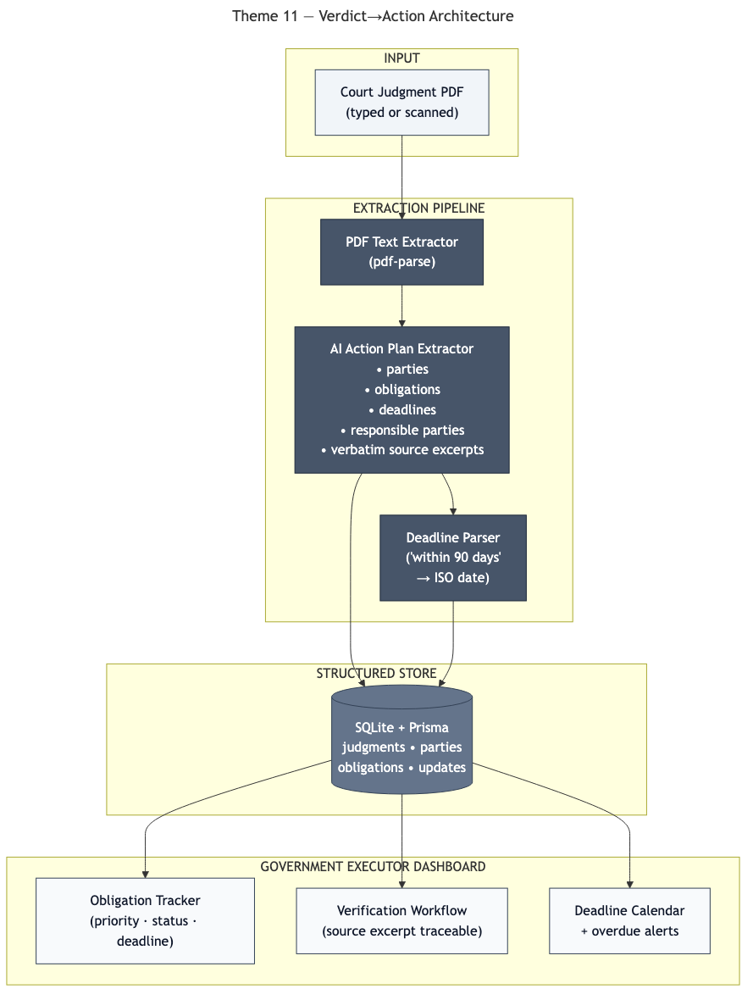

# Verdict→Action — From Court Judgments to Verified Action Plans

AI extracts obligations, deadlines, and owners with full traceability.

> **PanIIT AI for Bharat Hackathon** — Theme 11: Court Judgment Action Tracker

Verdict→Action helps government departments and law officers turn court judgments into verified execution plans. A judgment PDF is parsed into structured obligations with verbatim source excerpts, parsed deadlines, responsible parties, confidence-scored reasoning, and an officer verification workflow so departments can track compliance without losing legal traceability.

## Quick Start

```bash
git clone https://github.com/sridhar7601/verdict-to-action.git
cd verdict-to-action
cp .env.example .env
npm install
npx prisma generate
npx prisma migrate dev
npm run seed
npm run dev
```

Open [http://localhost:3000](http://localhost:3000).

## Demo Data

`npm run seed` creates three sample judgments covering environmental pollution, labor rights, and procurement transparency so you can review different obligation types and deadline parsing scenarios.

## Architecture

Judgment PDFs flow through text extraction, obligation parsing, deadline interpretation, officer verification, and cross-judgment tracking in a single audit-ready workflow.



## Tech Stack

- Next.js App Router + TypeScript
- Prisma + SQLite
- Tailwind CSS + shadcn/ui
- `pdf-parse` for typed PDF extraction
- Mock-first extraction logic in `lib/ai.ts`
- `date-fns` for deadline handling

## Demo Flow

1. Open the dashboard to show seeded judgment counts, deadline visibility, and obligation metrics.
2. Go to `Judgments` and open one of the seeded sample cases.
3. Review the extracted obligations with their verbatim source excerpts, reasoning, and parsed deadlines.
4. Verify an obligation to show the human-in-the-loop approval step.
5. Open the obligation tracker or a single obligation detail page to show status updates and audit history.

## Key Features

- Structured extraction of obligations, responsible parties, deadlines, and priorities from uploaded judgments.
- Verbatim source excerpts and page references for traceability.
- Officer verification before an obligation becomes actionable.
- Cross-judgment obligation tracking by status, priority, and deadline.
- Update history for an audit-ready compliance trail.

## Documentation

[docs/solution-document.md](docs/solution-document.md) · [PDF](docs/solution-document.pdf)

## Verification

```bash
npm install
npm run build
npm run seed
npm run dev
```

## Acknowledgments

Synthetic judgment data is included for demo purposes only. No real case data is used.

## License

MIT
